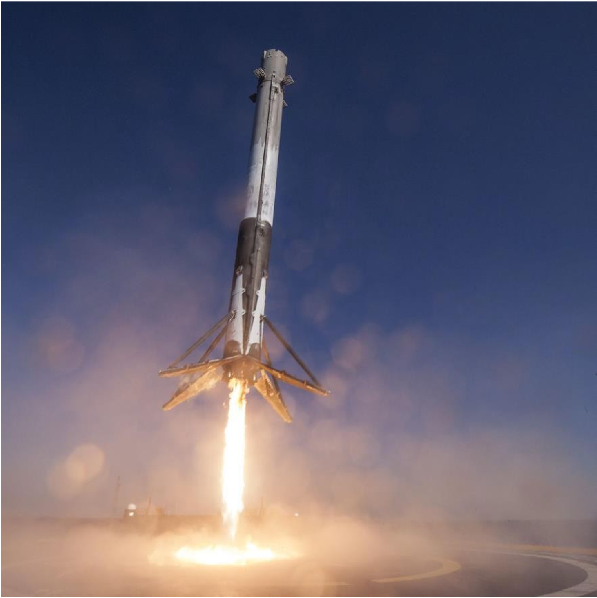
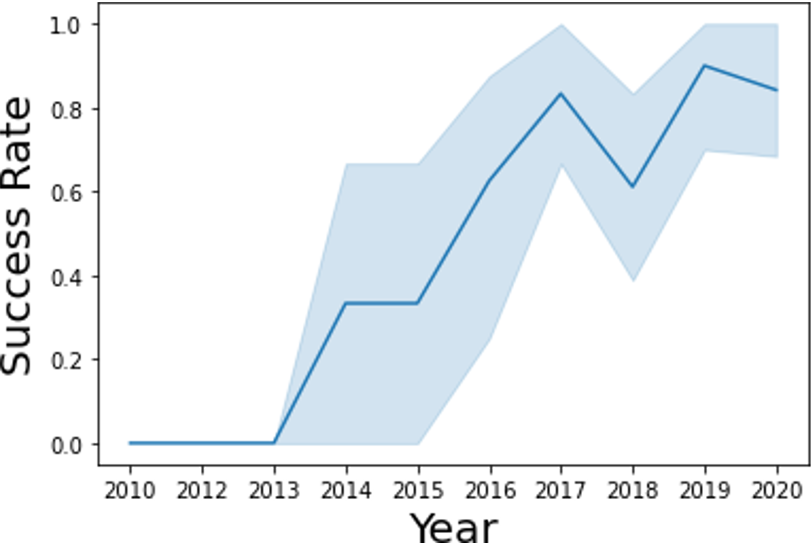
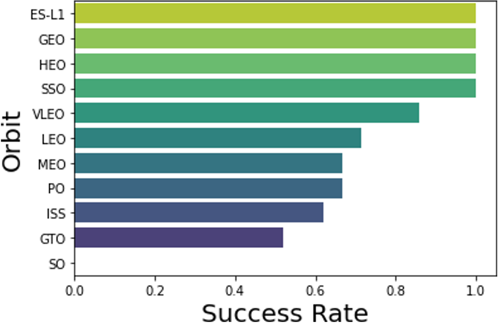
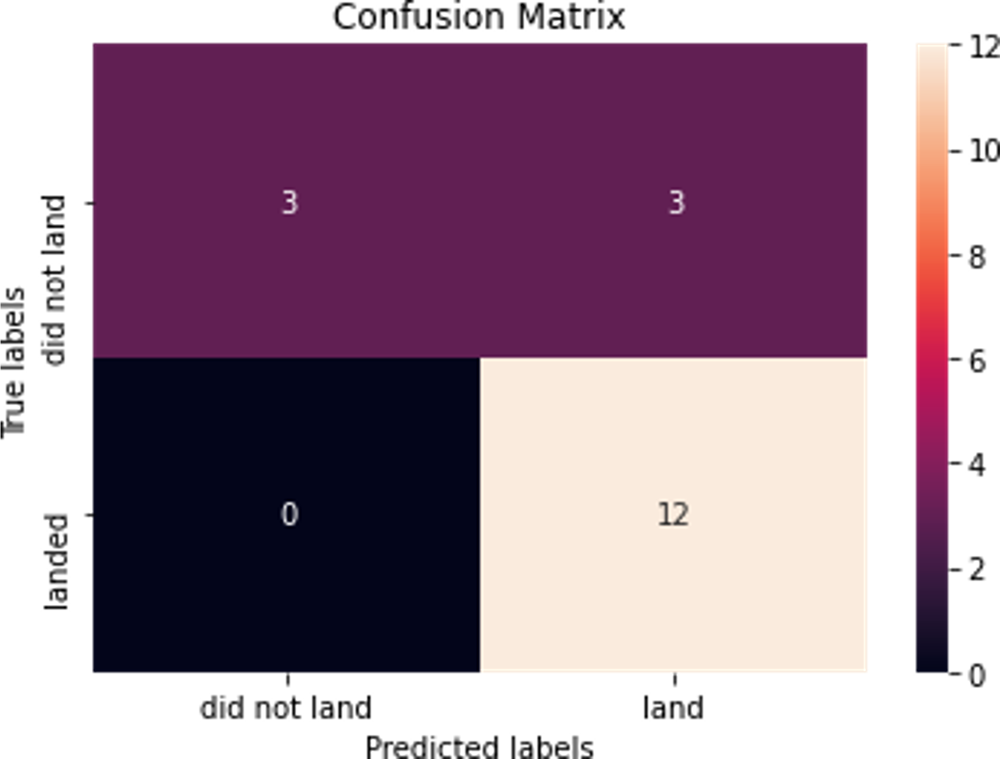

# Machine learning prediction of Space X Falcon 9 landing

## Table of Contents
* [General Info](#general-information)
* [Results](#Results)
* [Technologies Used](#technologies-used)
* [Contact](#contact)
<!-- * [License](#license) -->

## General Information
- In this project, we will predict if the Falcon 9 first stage will land successfully. SpaceX advertises Falcon 9 rocket launches on its website with a cost of 62 million dollars; other providers cost upward of 165 million dollars each, much of the savings is because SpaceX can reuse the first stage. Therefore if we can determine if the first stage will land, we can determine the cost of a launch.
- The goal is to train a machine learning model to predict successful stage 1 recovery
- The dataset is combined data from SpaceX public API and SpaceX Wikipedia page
- Perform data wrangling classifying true landings as successful and unsuccessful otherwise
- Perform exploratory data analysis (EDA) using visualization
- Perform interactive visual analytics using Folium
- Perform predictive analysis using classification models

## Results

<!-- If you have screenshots you'd like to share, include them here. -->

## Technologies Used
- Python
- Tensorflow
- Pandas
- Matplotlib
- Keras

## Contact
Created by [Miralireza Nabavi](anabavib@asu.edu) - feel free to contact me!
The comprehensive report is provided in final_report.pdf.
If you need the Folium analysis script, please contact me.
